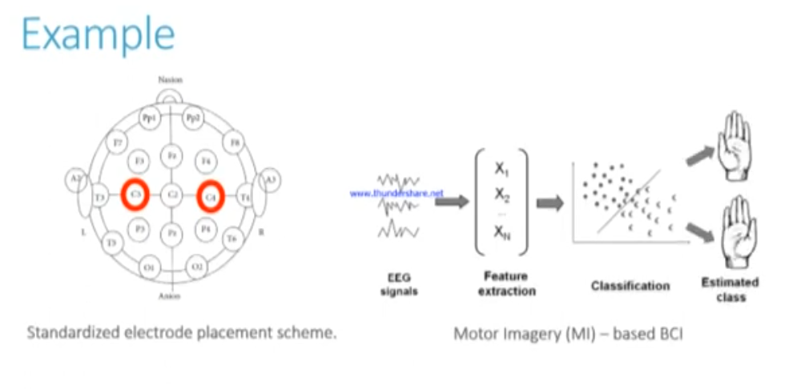

# Total Perspective Vortex

## Overview

<table align="center">
<tr>
<td width="45%" style="vertical-align:middle; padding-right:20px;">

This subject aims to create a brain computer interface based on electroencephalographic data (EEG data) with the help of machine learning algorithms. Using a subject’s EEG reading, you’ll have to infer what he or she is thinking about or doing - (motion) A or B in a t0 to tn timeframe.

</td>
<td width="55%" align="center">

</td>
</tr>
</table>

EEG data set consists of over 1500 one- and two-minute EEG recordings, obtained from 109 volunteers.

<b> Experimental Protocol </b>

Subjects performed different motor/imagery tasks while 64-channel EEG were recorded using the BCI2000 system (http://www.bci2000.org). Each subject performed 14 experimental runs: two one-minute baseline runs (one with eyes open, one with eyes closed), and three two-minute runs of each of the four following tasks:

* A target appears on either the left or the right side of the screen. The subject opens and closes the corresponding fist until the target disappears. Then the subject relaxes.
* A target appears on either the left or the right side of the screen. The subject imagines opening and closing the corresponding fist until the target disappears. Then the subject relaxes.
* A target appears on either the top or the bottom of the screen. The subject opens and closes either both fists (if the target is on top) or both feet (if the target is on the bottom) until the target disappears. Then the subject relaxes.
* A target appears on either the top or the bottom of the screen. The subject imagines opening and closing either both fists (if the target is on top) or both feet (if the target is on the bottom) until the target disappears. Then the subject relaxes.

The experimental runs were:

<table class="table" border="4px">
<thead>
<tr class="row-odd"><th class="head">
run
</th>
<th class="head">
task
</th>
</tr>
</thead>
<tbody>
<tr class="row-even"><td>
1
</td>
<td>
Baseline, eyes open
</td>
</tr>
<tr class="row-odd"><td>
2
</td>
<td>
Baseline, eyes closed
</td>
</tr>
<tr class="row-even"><td>
3, 7, 11
</td>
<td>
Motor execution: left vs right hand
</td>
</tr>
<tr class="row-odd"><td>
4, 8, 12
</td>
<td>
Motor imagery: left vs right hand
</td>
</tr>
<tr class="row-even"><td>
5, 9, 13
</td>
<td>
Motor execution: hands vs feet
</td>
</tr>
<tr class="row-odd"><td>
6, 10, 14
</td>
<td>
Motor imagery: hands vs feet
</td>
</tr>
</tbody>
</table>

Each annotation includes one of three codes (T0, T1, or T2):

- T0 corresponds to rest
- T1 corresponds to onset of motion (real or imagined) of the left fist (in runs 3, 4, 7, 8, 11, and 12) both fists (in runs 5, 6, 9, 10, 13, and 14)
- T2 corresponds to onset of motion (real or imagined) of the right fist (in runs 3, 4, 7, 8, 11, and 12) both feet (in runs 5, 6, 9, 10, 13, and 14)

## V.1.1 Preprocessing, parsing and formating

#### Filtering 

1) write a script to visualize raw data
2) then filter it to keep only useful frequency bands 
3) visualize again after this preprocessing

After visualize raw data EDF file contains 64 channels and multiple rows (accordingly file number in command line argument "-f"). Each channels represent electrode. Each electrode shows the signals which is a time series for measured amplitude values.

We will use signal bands between 8-30 Hz because they are for motor imagery experiment. 8-12 Hz is a Alpha band and 13-30 Hz is Beta band. 

Based on motor imagery studies we focus on channels located over the motor cortex (C3, Cz, C4) and parietal region (P3, Pz, P4). (This is after train results)

<i>Source: https://pmc.ncbi.nlm.nih.gov/articles/PMC6891287/ </i>

#### Extract events from annotations

EDF file contains continuous stream of electrical measurements. But ML model can't learn from one giant stream it needs individual examples with labels. So for this one first we are converting annotations to <b>event arrays</b>.

- T0 → code 1  (rest)
- T1 → code 2  (left fist or both fist)
- T2 → code 3  (right fist or both feet)

 Result type: [sample_number,  0,  event_code]

Result example: Used Annotations descriptions: [np.str_('T0'), np.str_('T1'), np.str_('T2')] 
(array([[    0,     0,     1],
       [  672,     0,     3],
       [ 1328,     0,     1],
       [ 2000,     0,     2],
       [ 2656,     0,     1], ...]))

Sampling rate of this dataset 160 Hz. 672 sample / 160 Hz = 4.2 seconds. Each event (rest, task) approximately takes 4 second.

#### Epoching

To be able to use continuous signal and event timeline we need to proccessed for <b>epoching/segmentation</b>. The aim for here dividing continuous time series data into smaller time windows.

## V.1.2 Treatment pipeline

It allows you to chain together multiple steps, such as data transformations and model training, into a single, cohesive process. This not only simplifies the code but also ensures that the same sequence of steps is applied consistently to both training and testing data, thereby reducing the risk of data leakage and improving reproducibility.

Components of a Pipeline:
- A pipeline in scikit-learn consists of a sequence of steps, where each step is a tuple containing a name and a transformer or estimator object.
- The final step in the pipeline must be an estimator (e.g., a classifier or regressor), while the preceding steps must be transformers (e.g., scalers, encoders).
