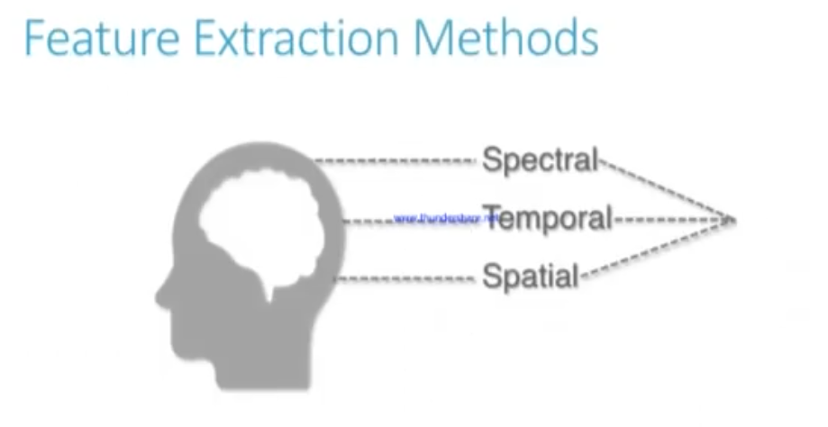

# Total Perspective Vortex

## Overview

<table align="center">
<tr>
<td width="45%" style="vertical-align:middle; padding-right:20px;">

This subject aims to create a brain computer interface based on electroencephalographic data (EEG data) with the help of machine learning algorithms. Using a subject’s EEG reading, you’ll have to infer what he or she is thinking about or doing - (motion) A or B in a t0 to tn timeframe.

</td>
<td width="55%" align="center">

</td>
</tr>
</table>

## V.1.1 Preprocessing, parsing and formating

#### Filtering 

1) write a script to visualize raw data
2) then filter it to keep only useful frequency bands 
3) visualize again after this preprocessing

After visualize raw data EDF file contains 64 channels and 9760 row. Each channels represent electrode. Each electrode shows the signals which is a time series for measured amplitude values.

We will use signal bands between 8-30 Hz because they are for motor imagery experiment. 8-12 Hz is a Alpha band and 13-30 Hz is Beta band. 

Based on motor imagery studies we focus on channels located over the motor cortex (C3, Cz, C4) and parietal region (P3, Pz, P4).

<i>Source: https://pmc.ncbi.nlm.nih.gov/articles/PMC6891287/ </i>

#### Feature extraction

<table align="center">
<tr>
<td width="45%" align="center">

</td>

<td width="55%" style="vertical-align:middle; padding-right:20px;">

With BCI there are three main sources of information that can be used to struct features from EEG signals.
- Spectral features
- Temporal features
- Spatial features

</td>

</tr>
</table>

<b>Spectral Analysis:</b>
Fourier theroem: <i>"time-domain signal can be expressed as sum of sines, each with specific amplitude and phase coefficients"</i>

