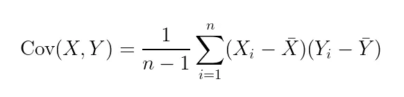
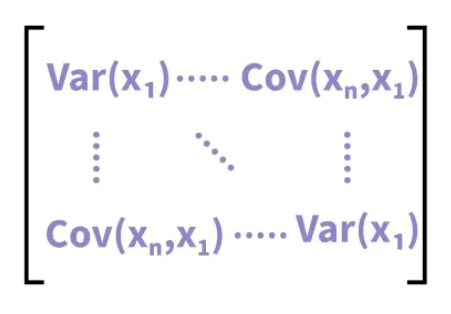
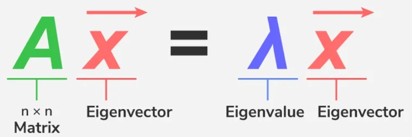

## CSP implementation

### Accordingly csp.py file here is the guidence for how to write your own csp:

<b>Step 1:</b> Covariance Calculation - Covariance Matrix (ft_fit)

<b>Step 2:</b> Eigen Decomposition of a Matrix (ft_fit)

After this three steps you have to get your top filters for n_components. Point for the get your components in here is, getting only top filters from all filters. E.g if your X_raw = (120, 64, 641), you have 64 channel and if you give n_components=4 in your csp() after the process you will get only the top 4 filters from 64 filter.

<b>Step 3:</b> Compute Power: compute features -> mean power (ft_fit & ft_transform)

<b>Step 4:</b> Standardize (ft_fit: calculate mean and std & ft_transform: use mean and std)

The aim for step3 and step 4 is converting your raw EEG data for LDA. And LDA can classify with this form. 

<b>Step 5:</b> Transform

Step5 is using step3 and step4 results for mean and std. The reason for using learned mean and std values is prevent the data leakage.

- Note: Training phrase contains fit and transform but prediction contain only transform.

### Covariance Matrix:

<b>Variance</b> is a statistical measure that quantifies how much the values of a variable deviate from their mean. In other words, it indicates the spread of the data: a high variance suggests that the data is widely distributed, while a low variance indicates that the values are more concentrated around the mean. <b>Covariance</b>, on the other hand, extends this concept to two variables and measures how they change together.

The formula to calculate the covariance between two variables (X and Y) is:

  

where:
- Xᵢ and Yᵢ are the individual values of the variables X and Y,
- 𝑋̅ and 𝑌̅ are the means of the variables X and Y,
- n is the number of observations.

<b>Positive covariance:</b> indicates that when one variable increases, the other tends to increase as well.   <b>Negative covariance:</b> suggest that when one variable increases, the other tends to decrease   <b>Zero covariance: </b> indicates that there is no linear relationship between two variables.

Covariance depends on the unit of measurement of the involved variables. Consequently, when the variables opearate on very different scales or units of measurement, comparing the covairance values becomes problematic.

To address this issue, it is often advisable to use normalization or standardization techniques on the variables, to bring them onto comparable scale. Only in this way we can  obtain a more accurate view of the relationships between the variables, allowing us to effectively use the covariance matrix for more robust analyses.

<b>Mathematical Definition</b>

<table align="center">
<tr>

<td width="50%" align="center">

</td>

<td width="50%" style="vertical-align:middle; padding-left:20px;">
The variance-covariance matrix is a square matrix with diagonal elements that represent the variance and the non-diagonal components that express covariance.
</td>

</tr>
</table>

### Eigen Decomposition

Eigen decomposition is a method to break down a square matrix into simpler components called eigenvalues and eigenvectors. This decomposition is significant because it transforms matrix operations into simpler, scalar operations involving eigenvalues, making computations easier.

  

<b>Eigenvalues</b> are unique scalar values linked to a matrix or linear transformation. They indicate how much an eigenvector gets stretched or compressed during the transformation.
The eigenvector's direction remains unchanged unless the eigenvalueis negative, in which case the direction is simply reversed.

<b>Eigenvectors</b> are non-zero vectors that, when multiplied by a matrix, only stretch or shrink without changing direction. The eigenvalue must be found first before the eigenvector.

<i>Standard eigendecomposition doesn't know class labels exsist but we need to find spitial filters that discriminate between classes because of that we will use generalized eigenvalue decomoposition. 

Generalized approach example: "Find directions where class A has high variance and class B has low variance".</i>

<b>The generalized eigenvalue problem (GEVP)</b> is a more complex version of the standart eigenvalue problem and typically aries in the form: <b>Ax = λBx</b> where A and B are square matrices of the same size, x is the eigenvector, and λ is the eigenvalue. The matrix A is typically symmetric, but B does not necessarily have to be symmetric, although in many cases, it is positive definite or at least symmetric.

