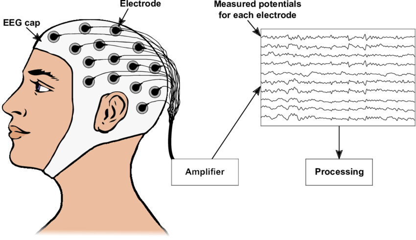
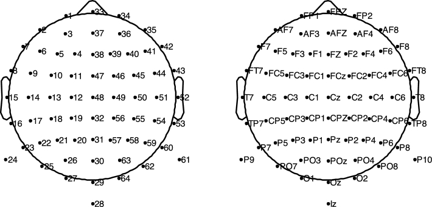
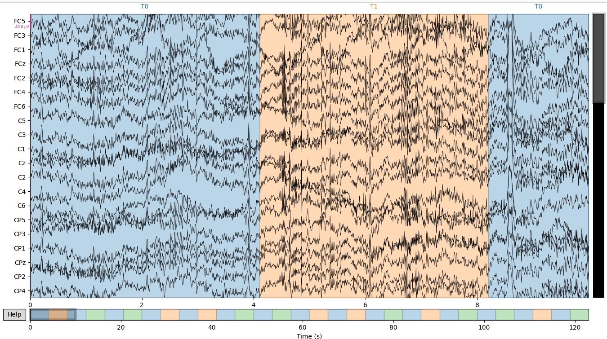
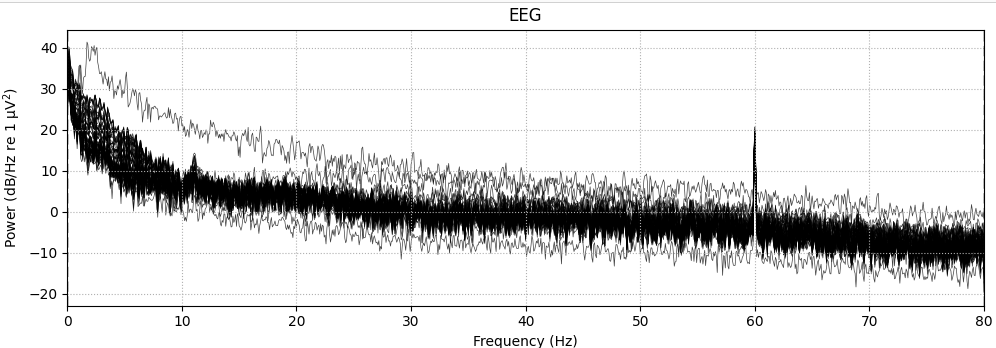
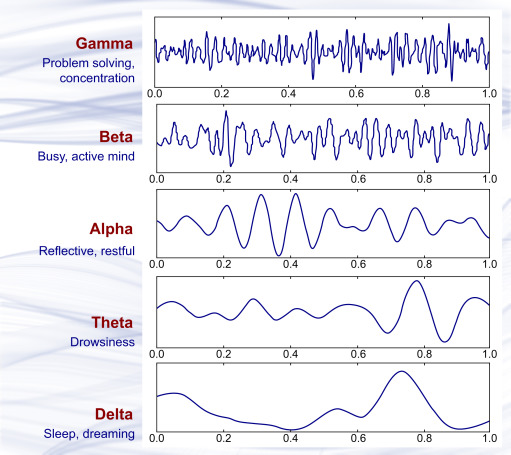
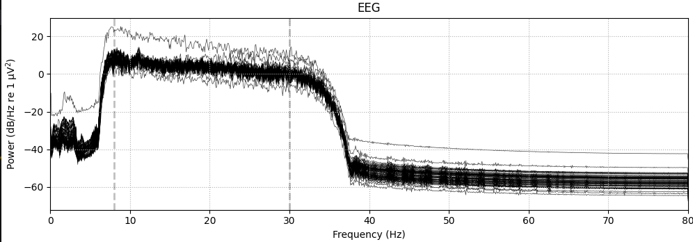

#  V.1 Preprocessing, parsing and formating

#### Electroencephalography (EEG) - The Window into Brain Activity

- Electroencephalography, commonly known as EEG, is a non-invasive method used by medical professionals to record electrical activity in the brain.
- This is done using electrodes placed along the scalp.

	

A set of 64-channel EEGs from subjects who performed a series of motor/imagery tasks has been contributed to PhysioNet by the developers of the BCI2000 instrumentation system for brain-computer interface research.

	

#### Experimental Protocol

Subjects performed different motor/imagery tasks while 64-channel EEG were recorded using the BCI2000 system. Each subject performed 14 experimental runs: two one-minute baseline runs (one with eyes open, one with eyes closed), and three two-minute runs of each of the four following tasks:

- A target appears on either the left or the right side of the screen. The subject opens and closes the corresponding fist until the target disappears. Then the subject relaxes.
- A target appears on either the left or the right side of the screen. The subject imagines opening and closing the corresponding fist until the target disappears. Then the subject relaxes.
- A target appears on either the top or the bottom of the screen. The subject opens and closes either both fists (if the target is on top) or both feet (if the target is on the bottom) until the target disappears. Then the subject relaxes.
- A target appears on either the top or the bottom of the screen. The subject imagines opening and closing either both fists (if the target is on top) or both feet (if the target is on the bottom) until the target disappears. Then the subject relaxes.

 
In summary, the experimental runs were:

1) Baseline, eyes open
2) Baseline, eyes closed
3) Task 1 (open and close left or right fist)
4) Task 2 (imagine opening and closing left or right fist)
5) Task 3 (open and close both fists or both feet)
6) Task 4 (imagine opening and closing both fists or both feet)
7) Task 1
8) Task 2
9) Task 3
10) Task 4
11) Task 1
12) Task 2
13) Task 3
14) Task 4

 

Each annotation includes one of three codes (T0, T1, or T2):

- <b>T0</b> corresponds to rest
- <b>T1</b> corresponds to onset of motion (real or imagined) of
the left fist (in runs 3, 4, 7, 8, 11, and 12)
both fists (in runs 5, 6, 9, 10, 13, and 14)
- <b>T2</b> corresponds to onset of motion (real or imagined) of
the right fist (in runs 3, 4, 7, 8, 11, and 12)
both feet (in runs 5, 6, 9, 10, 13, and 14)

### Preprocessing Steps

<table align="center">
<tr>
<td width="30%" style="vertical-align:middle; padding-right:20px;">

The signals of all 64 channels are visualized for T0, T1, and T2 runs over a 120-second period. (run visualize function)

</td>
<td width="55%" align="center">

</td>
</tr>
</table>

<table align="center">
<tr>

<td width="55%" align="center">

</td>

<td width="30%" style="vertical-align:middle; padding-right:20px;">

Signal frequency range between 0-80 Hz. (run visualize function)
</td>

</tr>
</table>

<b> Frequency Band Analysis </b>

EEG data is a complex signal that represents the electrical activity of the brain. EEG signal into different frequency bands: Delta, Theta, Alpha, Beta, and Gamma. These bands are significant in neuroscientific studies as they are associated with different brain states and activities.

	

1) <b>Delta (0.5 – 4 Hz)</b>: Delta waves are the slowest brainwaves and are typically associated with deep sleep and restorative processes in the body. They are most prominent during dreamless sleep and play a role in healing and regeneration.
2) <b>Theta (4 – 8 Hz)</b>: Theta waves occur during light sleep, deep meditation, and REM (Rapid Eye Movement) sleep. They are linked to creativity, intuition, daydreaming, and fantasizing. Theta states are often associated with subconscious mind activities.
3) <b>Alpha (8 – 12 Hz>):</b> Alpha waves are present during physically and mentally relaxed states but still alert. They are typical in wakeful states that involve a relaxed and effortless alertness. Alpha waves aid in mental coordination, calmness, alertness, and learning.
4) <b>Beta (12 – 30 Hz>):</b> Beta waves dominate our normal waking state of consciousness when attention is directed towards cognitive tasks and the outside world. They are associated with active, busy or anxious thinking and active concentration.
5) <b>Gamma (30 – 45 Hz>):</b> Gamma waves are involved in higher mental activity and consolidation of information. They are important for learning, memory, and information processing. Gamma waves are thought to be the fastest brainwave frequency and relate to simultaneous processing of information from different brain areas.

 

<i>Result:</i> We will use signal bands between 8-30 Hz because they are for motor imagery experiment. 8-12 Hz is a Alpha band and 13-30 Hz is Beta band.

 

<table align="center">
<tr>

<td width="55%" align="center">

</td>

<td width="30%" style="vertical-align:middle; padding-right:20px;">
Here is the filtered raw that we will use for model training (run filtered function)

</td>

</tr>
</table>

#### Epoching

To be able to use continuous signal and event timeline we need to proccessed for <b>epoching/segmentation</b>. The aim for here dividing continuous time series data into smaller time windows.

Returns:

<u>events:</u> ndarray of int, shape (n_events, 3)
 The identity and timing of experimental events, around which the epochs were created.
 
<u>event_i d:</u> variable that can be passed to Epochs.

After extracting epochs from a Raw instance using the <u>mne.Epochs</u> function, we obtain the data (X) and labels (y) datasets used to train the model.

#### Example of epochs result:

<table align="center">
<tr>

<td width="50%">
Data Type: class 'numpy.ndarray' 
Data Shape: (15, 64, 321) 
</td>

<td width="50%">
15 trial (epoch), 64 channel, 321 example 
sfreq=160 Hz, tmin=0 tmax=2 --> 320 sample
</td>

</tr>

<tr>

<td width="50%">
Labels Type: class 'numpy.ndarray' 
Labels Shape: (15,)
</td>

<td width="50%">
15  epoch --> 15 label
</td>

</tr>

<tr>

<td width="50%">
Unique class codes: [2 3] 
Class balance: [0 0 7 8]
</td>

<td width="50%">
T1(left hand) -> 2, T2(right hand) -> 3 
T1 ->  trial, T2 -> 8 trial
</td>

</tr>
</table>

After the filtering and epoching procedures, data is ready to be sent to the model for training.
