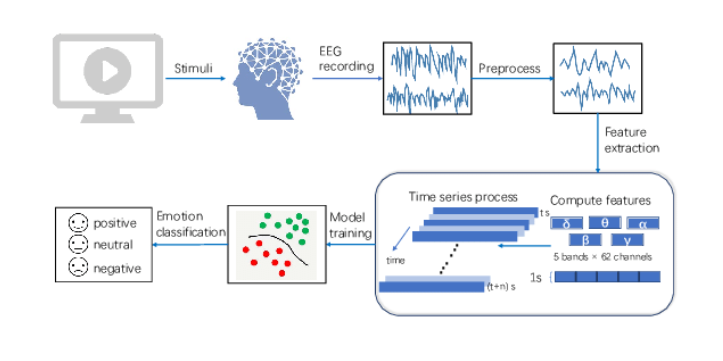
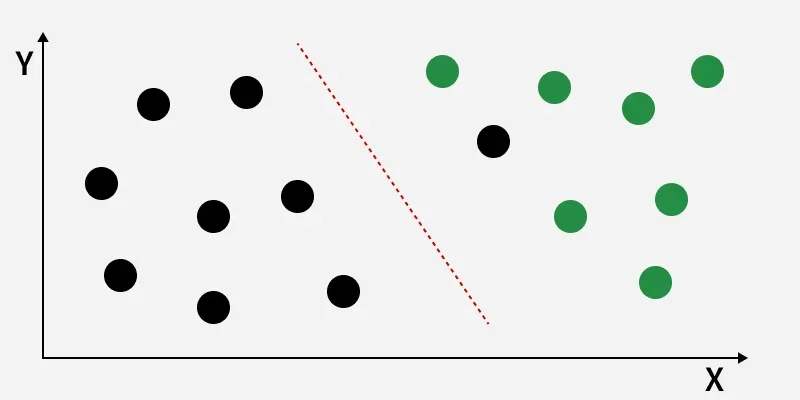
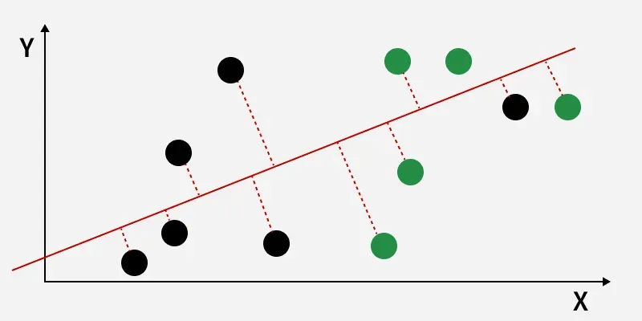
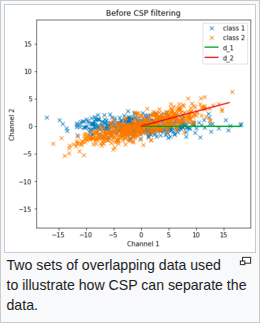
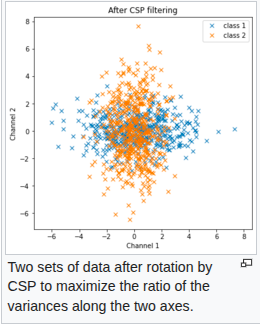
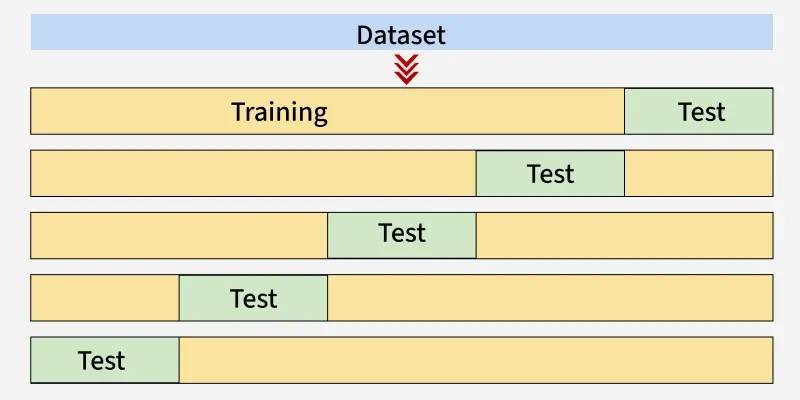

# Total Perspective Vortex

## Overview

<table align="center">
<tr>
<td width="45%" style="vertical-align:middle; padding-right:20px;">

This subject aims to create a brain computer interface based on electroencephalographic data (EEG data) with the help of machine learning algorithms. Using a subject’s EEG reading, you’ll have to infer what he or she is thinking about or doing - (motion) A or B in a t0 to tn timeframe.

</td>
<td width="55%" align="center">

</td>
</tr>
</table>

## Goals

<table align="center">
<tr>
<td width="50%" style="vertical-align:middle; padding-right:20px;">

- Process EEG datas (parsing and filtering)
- Implement a dimensionality reduction algorithm
- Use the pipeline object from scikit-learn
- Classify a data stream in "real time"

</td>
<td width="50%" align="center">

</td>
</tr>
</table>
<i>We will classify as a thinking or doing.</i>

## V.1.1 Preprocessing, parsing and formating

This part handled in [here](preprocessing/readme.md).

## V.1.2 Treatment pipeline

It allows you to chain together multiple steps, such as data transformations and model training, into a single, cohesive process. This not only simplifies the code but also ensures that the same sequence of steps is applied consistently to both training and testing data, thereby reducing the risk of data leakage and improving reproducibility.

Components of a Pipeline:
- A pipeline in scikit-learn consists of a sequence of steps, where each step is a tuple containing a name and a transformer or estimator object.
- The final step in the pipeline must be an estimator (e.g., a classifier or regressor), while the preceding steps must be transformers (e.g., scalers, encoders).

 

Accordingly subject processing pipeline  to be setup:
- Dimensionality reduction algorithm (ie : PCA, ICA, CSP, CSSP...).
- Classification algorithm, there is plenty of choice among those available in sklearn,
to output the decision of what data chunk correspond to what kind of motion.
- "Playback" reading on the file to simulate a data stream.

 

### Linear Discriminant Analysis

Linear Discriminant Analysis (LDA) is supervised classification problem that helps separate two or more classes by converting higher-dimensional data space into a lower-dimensional space. It is used to identify a linear combination of features that best separates classes within a dataset.

<table align="center">
<tr>

<td width="40%" align="center">

</td>

<td width="50%" style="vertical-align:middle; padding-right:20px;">

When data points belonging to two classes are plotted, if they are not linearly separable LDA will attempt to find a projection that maximizes class separability.
</td>
</tr>

<tr>

<td width="50%" style="vertical-align:middle; padding-right:20px;">

The image shows classes (black and green) that are not linearly separable. LDA finds a new axis (red dashed line) that maximizes the distance between class means while minimizing within-class variance, improving class separation for better classification.

</td>

<td width="50%" align="center">

</td>

</tr>
</table>

 

### Common spatial pattern 

Common spatial pattern (CSP) is a mathematical procedure used in signal processing for separating a multivariate signal into additive subcomponents which have maximum differences in variance between two windows.

<table align="center">
<tr>
<td width="50%" align="center">

</td>

<td width="50%" align="center">

</td>
</tr>
</table>

#### Relation between LDA and CSP

Linear discriminant analysis (LDA) and CSP apply in different circumstances. LDA separates data that have different means, by finding a rotation that maximizes the (normalized) distance between the centers of the two sets of data. On the other hand, CSP ignores the means. Thus CSP is good, for example, in separating the signal from the noise in an event-related potential (ERP) experiment because both distributions have zero mean and there is no distinction for LDA to separate. Thus CSP finds a projection that makes the variance of the components of the average ERP as large as possible so the signal stands out above the noise.

### V.1.3 Implementation

This part will handled last. ft_csp

### V.1.4 Train, Validation and Test

#### Cross Validation
Cross-validation is a technique used to check how well a machine learning model performs on unseen data while preventing overfitting. It works by:

- Splitting the dataset into several parts.
- Training the model on some parts and testing it on the remaining part.
- Repeating this resampling process multiple times by choosing different parts of the dataset.
- Averaging the results from each validation step to get the final performance.

  

##### Stratified Cross-Validation
It is a technique that ensures each fold of the cross-validation process has the same class distribution as the full dataset. This is useful for imbalanced datasets where some classes are underrepresented.

- The dataset is divided into k folds, keeping class proportions consistent in each fold.
- In each iteration, one fold is used for testing and the remaining folds for training.
- This process is repeated k times so that each fold is used once as the test set.
- It helps classification models generalize better by maintaining balanced class representation.